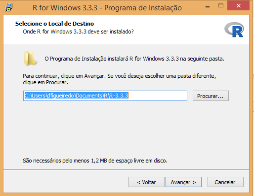
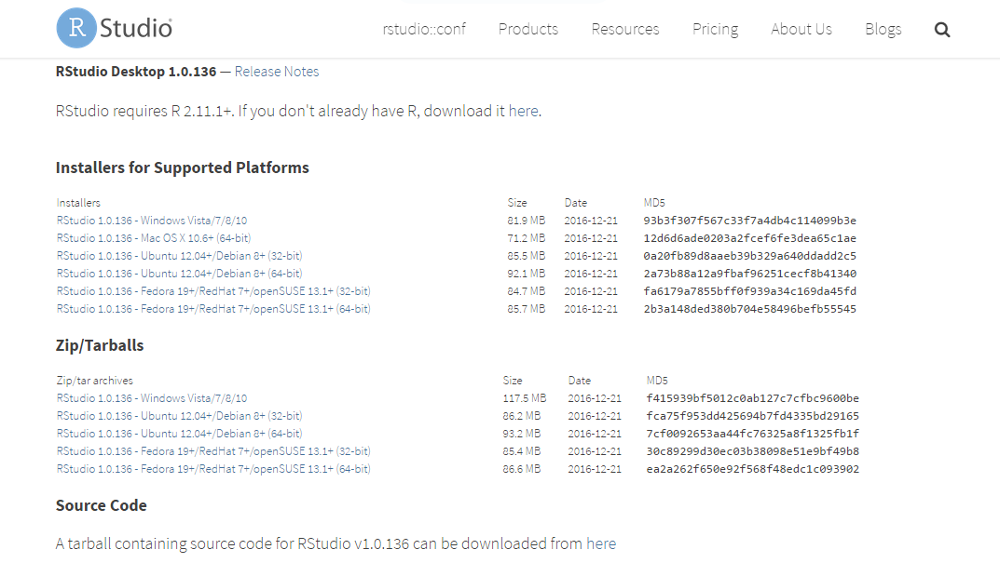

A seguir teremos alguns tutoriais de instalação do R, Rstudio e alguns pacotes 
nos principais sistemas operacionais.


### Instalação do R

Para instalar o R no Windows, o primeiro passo é fazer o download do instalador.
Entre [neste link](https://cran.r-project.org/bin/windows/base/) e clique em 
"Download R 3.3.3 for Windows (71 megabytes, 32/64 bit)" (a versão pode não ser
a mesma.).

Salve este arquivo em qualquer pasta do seu computador. No meu caso salvei na pasta
"Downloads".


Clique duas vezes com o botão esquerdo neste arquivo. Ele pedirá para você selecionar
a linguagem da instalação. Selecione o idioma do seu interesse e clique em OK.
Em seguida é só ir clicando em avançar, como em uma instalação comum. Preste a atenção
apenas na tela em que ele pede para você escolher a pasta de instalação. Se você escolher
uma pasta que não está dentro da pasta do seu usuário, você precisará de acesso de 
administrador. Se escolher uma pasta dentro do seu usuário (como na imagem abaixo),
não precisará.



Clique em avançar até o final e depois em concluir.


Pronto! Agora o R está instalado!

### Instalação do RStudio

Agora vamos instalar o RStudio, a IDE que usamos para editar e executar códigos em
R. Para fazer o download, entre [nesta página](https://www.rstudio.com/products/rstudio/download/).



Nessa página você tem duas opções:

1. Se você tiver acesso administrador, baixe a versão que está na lista de *Installers for Supported Platforms*.  Em seguida a instalação
será bem simples: fazer o download, abrir o instalador e ir clicando no botão 
avançar. 
2. Se você não tiver acesso de administrador na máquina faça o download da versão
que está na lista *Zip/Tarballs*. (veja imagem acima)

#### 1.  Instalando se você for administrador

Clique duas vezes no arquivo que você fez o download da página do RStudio (ver
imagem abaixo) e siga as instruções de instalação.


#### 2. Instalação se você não for administrador

Se você não for administrador, você deve ter feito o download de um arquivo do tipo
*.zip* que contém o código do RStudio. É o arquivo selecionado na imagem abaixo.


Clique com o botão direito neste arquivo e dedpois em *Extrair Tudo* conforme a 
imagem abaixo.


Você verá uma tela como a imagem a seguir. Não mude nada e clique em extrair.
Espere o Windows completar a extração.


Agora na pasta *Downloads* (a pasta que deixamos como local de extração - imagem acima)
você terá uma pasta chamada: `RStudio-1.0.136`. 

Abra essa pasta e entre na subpasta com nome `bin`. Em seguida procure pelo arquivo]chamado `rstudio`
e clique duas vezes. Isso abrirá o RStudio. Recomendo fixar o programa na barra de tarefas 
para não ter que ficar procurando nessa pasta sempre que quiser abrí-la. 

**NOTE**: se você excluir a pasta que extraimos, o RStudio irá parar de funcionar.


### Instalação de pacotes do R

Com o RStudio aberto, você verá a seguinte tela. Digite `install.packages("tidyverse")` no console e aperte `Enter`, como está na imagem abaixo. Isso irá instalar uma série de pacotes muito
utilizados no R. Ao rodar este código uma série de comandos aparecerá no console,
no final de tudo você deve encontrar algo do tipo:

```
package ‘tidyverse’ successfully unpacked and MD5 sums checked

The downloaded binary packages are in
	C:\Users\dfigueiredo\AppData\Local\Temp\Rtmpym4SPN\downloaded_packages
```

Indicando que o pacote foi instalado corretamente.


